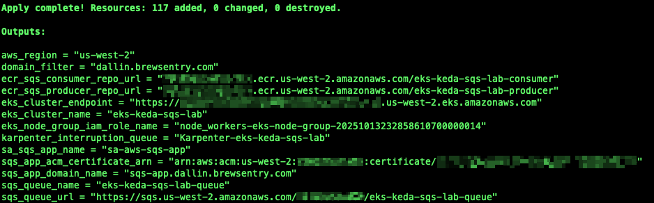

# Using KEDA to Scale AWS SQS with Amazon Elastic Kubernetes Service (EKS)


[](https://developer.hashicorp.com/terraform)
[](https://keda.sh/)
[](https://aws.amazon.com/eks/)
[](https://fluxcd.io/)

## Table of Contents

1. [Introduction](#introduction)
2. [What is Kubernetes Event-driven Autoscaling (KEDA)?](#what-is-kubernetes-event-driven-autoscaling-keda)
   1. [Benefits of using KEDA with Amazon EKS](#benefits-of-using-keda-with-amazon-eks)
3. [Architecture Overview](#architecture-overview)
4. [Prerequisites](#prerequisites)
5. [Setup and Deploy Infrastructure](#setup-and-deploy-infrastructure)
6. [Configure access to Amazon EKS Cluster](#configure-access-to-amazon-eks-cluster)
7. [Create and Push SQS App Docker Images to Amazon ECR](#create-and-push-sqs-app-docker-images-to-amazon-ecr)
   1. [Build the Docker Images](#build-the-docker-images)
   2. [Push the Docker Images to Amazon ECR](#push-the-docker-images-to-amazon-ecr)
8. [Configure and Install Flux](#configure-and-install-flux)
9. [Managing Flux](#managing-flux)
10. [Kubernetes Addons managed by Flux](#kubernetes-addons-managed-by-flux)
11. [Applications managed by Flux](#applications-managed-by-flux)
12. [Demo](#demo)
13. [Clean Up](#clean-up)
    1. [Clean up Applications managed by Flux from Kubernetes](#clean-up-applications-managed-by-flux-from-kubernetes)
    2. [Clean up Kubernetes AddOns managed by Flux from Kubernetes](#clean-up-kubernetes-addons-managed-by-flux-from-kubernetes)
    3. [Uninstall Flux from Kubernetes](#uninstall-flux-from-kubernetes)
    4. [Clean up Terraform](#clean-up-terraform)
14. [Conclusion](#conclusion)

## Introduction

You can access the code in my [GitHub Repository](https://github.com/junglekid/aws-eks-keda-sqs-lab).

## What is Kubernetes Event-driven Autoscaling (KEDA)?

Kubernetes Event-driven Autoscaling or [KEDA](https://keda.sh/) is an application-level autoscaler for Kubernetes workloads. It extends the basic autoscaling capabilities provided by Kubernetes, allowing you to scale applications in response to real-time events rather than just metrics like CPU or memory usage. Here are the key features and concepts of KEDA:

1. **Event-Driven**: KEDA works by scaling applications based on events from various sources, such as message queues, databases, timers, or any event source that can provide metrics. This allows for more dynamic and responsive scaling compared to traditional metric-based autoscaling.

2. **Support for Multiple Event Sources**: KEDA supports a wide range of event sources, including popular message queues like Kafka, RabbitMQ, Azure Service Bus, AWS SQS, and many others. It can also integrate with custom event sources.

3. **Seamless Integration with Kubernetes**: KEDA is implemented as a Kubernetes Operator, which means it integrates seamlessly with the Kubernetes ecosystem. It extends Kubernetes by adding new custom resources that define how applications should scale in response to events.

4. **ScaledObject Custom Resource**: The key custom resource in KEDA is the `ScaledObject`. This resource defines how a particular deployment or job should scale in response to events. You specify the target event source, the scaling triggers, and other scaling parameters in a `ScaledObject`.

5. **Scale-to-Zero**: One of the unique features of KEDA is its ability to scale workloads down to zero pods. This means that when there are no events to process, the application can release all its resources, leading to cost savings, especially in cloud environments.

6. **Horizontal Pod Autoscaler (HPA) Integration**: KEDA can work in conjunction with Kubernetes' built-in Horizontal Pod Autoscaler. It activates the HPA based on event metrics, allowing for a more dynamic and responsive autoscaling mechanism.

7. **Flexible and Extensible**: KEDA is designed to be extensible, allowing for the addition of new scalers (event sources) as needed. Its architecture is modular, which makes it easier to extend and adapt to specific needs.

KEDA is particularly useful for applications that need to respond quickly to fluctuating workloads, such as those processing events from message queues or reacting to real-time data streams. Its ability to scale to zero also makes it an attractive option for cost optimization in cloud-native environments.

or

Kubernetes Event-driven Autoscaling or [KEDA](https://keda.sh/) is a component for Kubernetes that provides event-driven autoscaling capabilities. It extends the standard autoscaling features of Kubernetes, which typically scale applications based on metrics like CPU and memory usage, by enabling autoscaling based on a wide range of events or metrics from external sources. Here's a detailed explanation of KEDA's main features and how it works:

1. **Event-Driven Scaling**: KEDA allows Kubernetes deployments to scale in response to events, not just system metrics. These events could be anything from a message in a queue, a change in a database, or a custom metric from an application.

2. **Integration with Multiple Sources**: KEDA supports a variety of event sources and services, such as Azure Event Hubs, Apache Kafka, AWS SQS, Google Cloud Pub/Sub, and more. This makes it versatile for use in many different environments and scenarios.

3. **Custom and Fine-Grained Scaling Rules**: You can define custom scaling rules based on the specific events your application is interested in. This allows for more precise control over when and how your application scales.

4. **Works with Standard Kubernetes Components**: KEDA is designed to work seamlessly with standard Kubernetes components like Deployments, Jobs, and StatefulSets. It extends the Kubernetes Horizontal Pod Autoscaler (HPA) to support event-driven scaling.

5. **Minimal Overhead**: KEDA operates with a small footprint and minimal overhead, making it efficient and suitable for lightweight applications.

6. **Active and Standby Scaling**: KEDA can scale applications to zero when there are no events to handle, and quickly scale them back up when events occur. This is particularly useful for reducing costs and resource usage when the application is idle.

KEDA is particularly useful in scenarios where applications need to respond quickly to fluctuating workloads that are event-driven, such as processing orders from a queue, handling real-time data streams, or responding to webhooks. It provides a more dynamic and responsive scaling mechanism compared to traditional metric-based autoscaling.

### Benefits of using KEDA with Amazon EKS

Using Kubernetes Event-driven Autoscaling (KEDA) with Amazon Elastic Kubernetes Service (EKS) offers several benefits, particularly for organizations looking to build and manage scalable, event-driven applications in a cloud environment. Here are some of the key advantages:

1. **Efficient Resource Utilization**: KEDA's ability to scale applications based on actual demand, including scaling to zero, ensures efficient use of resources. This is particularly beneficial in a cloud environment like EKS where resource usage directly impacts costs.

2. **Enhanced Scalability for Event-Driven Workloads**: EKS provides a robust platform for running Kubernetes workloads, and KEDA enhances this by enabling more responsive and dynamic scaling based on events. This is ideal for workloads that are event-driven, such as those processing messages from queues or reacting to changes in databases.

3. **Cost-Effective**: By scaling workloads to zero when not in use, KEDA helps to reduce costs. In an EKS environment, where you pay for the resources you use, this can lead to significant savings, especially for workloads with variable or sporadic traffic patterns.

4. **Seamless Integration**: KEDA integrates seamlessly with EKS, allowing for easy deployment and management of event-driven autoscaling. This integration simplifies the operational complexity and reduces the effort required to manage application scaling.

5. **Support for a Wide Range of Event Sources**: KEDA supports numerous event sources, including those commonly used in AWS environments, like Amazon SQS, SNS, and CloudWatch. This makes it versatile and suitable for various application scenarios in EKS.

6. **Improved Application Performance and Responsiveness**: By automatically scaling based on real-time events, applications can maintain optimal performance levels, responding efficiently to spikes in demand without manual intervention.

7. **Flexibility and Customization**: KEDA allows for detailed customization of scaling rules and triggers, giving teams the flexibility to tailor the scaling behavior to their specific application needs and traffic patterns.

8. **Simplified DevOps Processes**: With KEDA handling the complexity of event-driven autoscaling, DevOps teams can focus more on other aspects of application development and infrastructure management, improving overall operational efficiency.

9. **Better Use of EKS Features**: KEDA complements EKS's existing features, like network policies, security groups, and load balancing, ensuring that the autoscaling process is not just effective but also secure and well-integrated with the overall infrastructure.

10. **Community and Ecosystem Support**: Being an open-source project, KEDA benefits from strong community support and continuous development. This ensures compatibility with the latest Kubernetes features and trends, which is crucial for maintaining a modern cloud-native infrastructure on EKS.

In summary, integrating KEDA with EKS enhances the capabilities of Kubernetes in handling event-driven, dynamic workloads in a cloud environment, leading to improved performance, cost efficiency, and operational simplicity.


<!--  -->

## Architecture Overview

- HashiCorp Terraform
- KEDA
- Flux
- GitHub
- Amazon Elastic Kubernetes Service (EKS)
- Amazon Elastic Container Registry (ECR)
- AWS Key Management Service (KMS)
- Amazon Route 53
- AWS Certificate Manager (ACM)
- Amazon Virtual Private Cloud (Amazon VPC)
- IAM policies and roles

## Prerequisites

Before you begin, make sure you have the following before starting:

1. An active AWS account. You can create a new [AWS account here](https://repost.aws/knowledge-center/create-and-activate-aws-account).
2. AWS CLI installed and configured. Instructions can be found [here](https://aws.amazon.com/cli/).
3. Terraform installed. Instructions can be found [here](https://developer.hashicorp.com/terraform/tutorials/aws-get-started/install-cli).
4. Helm installed. Instructions can be found [here](https://helm.sh/docs/intro/install).
5. Kubernetes CLI (kubectl). Instructions can be found [here](https://kubernetes.io/docs/tasks/tools/#kubectl).
6. Flux CLI. Instructions can be found [here](https://fluxcd.io/flux/installation/#install-the-flux-cli).
7. A GitHub Personal Access Token. Instructions can be found [here](https://docs.github.com/en/authentication/keeping-your-account-and-data-secure/managing-your-personal-access-tokens#creating-a-personal-access-token-classic).
8. k9s - Kubernetes CLI To Manage Your Clusters In Style. Instructions can be found [here](https://k9scli.io/topics/install/)

## Setup and Deploy Infrastructure

Follow these steps to set up the environment.

1. Set variables in "locals.tf". Below are some of the variables that should be set.

   - aws_region
   - aws_profile
   - tags
   - custom_domain_name
   - public_base_domain_name

2. Update Terraform S3 Backend in provider.tf

   - bucket
   - key
   - profile
   - dynamodb_table

3. Navigate to the Terraform directory

   ```bash
   cd terraform
   ```

4. Initialize Terraform

   ```bash
   terraform init
   ```

5. Validate the Terraform code

   ```bash
   terraform validate
   ```

6. Run, review, and save a Terraform plan

   ```bash
   terraform plan -out=plan.out
   ```

7. Apply the Terraform plan

   ```bash
   terraform apply plan.out
   ```

8. Review Terraform apply results

   

## Configure access to Amazon EKS Cluster

Amazon EKS Cluster details can be extracted from terraform output or by accessing the AWS Console to get the name of the cluster. This following command can be used to update the kubeconfig in your local machine where you run kubectl commands to interact with your EKS Cluster. Navigate to the root of the directory of the GitHub repo and run the following commands:

   ```bash
   cd terraform

   AWS_REGION=$(terraform output -raw aws_region)
   EKS_CLUSTER_NAME=$(terraform output -raw eks_cluster_name)
   aws eks --region $AWS_REGION update-kubeconfig --name $EKS_CLUSTER_NAME
   ```

Results of configuring kubeconfig.


## Create and Push SQS App Docker Images to Amazon ECR

### Build the Docker Images

Set the variables needed to build and push your Docker image. Navigate to the root of the directory of the GitHub repo and run the following commands:

```bash
cd terraform

AWS_REGION=$(terraform output -raw aws_region)
ECR_SQS_CONSUMER_REPO=$(terraform output -raw ecr_sqs_consumer_repo_url)
ECR_SQS_PRODUCER_REPO=$(terraform output -raw ecr_sqs_producer_repo_url)
```

To build the Docker image, run the following command:

```bash
cd ..
docker build --platform linux/amd64 --no-cache --pull -t ${ECR_SQS_CONSUMER_REPO}:latest ./containers/sqs-consumer
docker build --platform linux/amd64 --no-cache --pull -t ${ECR_SQS_PRODUCER_REPO}:latest ./containers/sqs-producer
```

### Push the Docker Images to Amazon ECR

To push the Docker image to Amazon ECR, authenticate to your private Amazon ECR registry. To do this, run the following command:

```bash
aws ecr get-login-password --region $AWS_REGION | docker login --username AWS --password-stdin $ECR_SQS_CONSUMER_REPO
aws ecr get-login-password --region $AWS_REGION | docker login --username AWS --password-stdin $ECR_SQS_PRODUCER_REPO
```

Once authenticated, run the following command to push your Docker image to the Amazon ECR repository:

```bash
docker push ${ECR_SQS_CONSUMER_REPO}:latest
docker push ${ECR_SQS_PRODUCER_REPO}:latest
```

## Configure and Install Flux

1. Configure Variables needed to install Flux

   ```bash
   export GITHUB_TOKEN='<REPLACE_WITH_GITHHUB_TOKEN>'
   export GITHUB_USER='<REPLACE_WITH_GITHUB_USER>'
   export GITHUB_OWNER='<REPLACE_WITH_GITHUB_OWNER>'
   export GITHUB_REPO_NAME='<REPLACE_WITH_GITHUB_REPO_NAME>'
   ```

2. Configure Flux Repository by running the "configure.sh" script. The "configure.sh" script updates the various applications with the necessary values to run correctly. Navigate to the root of the directory of the GitHub repo and run the following commands:

   ```bash
   cd scripts

   ./configure.sh
   cd ..
   ```

3. Results of running the "configure.sh" script.

   

4. Install Flux on the Amazon EKS Cluster

   ```bash
   flux bootstrap github \
     --components-extra=image-reflector-controller,image-automation-controller \
     --owner=$GITHUB_OWNER \
     --repository=$GITHUB_REPO_NAME \
     --private=false \
     --path=clusters/eks-keda-sqs-lab \
     --personal
   ```

5. Results of installing Flux on the Amazon EKS Cluster.

   

6. Wait 2 to 5 minutes for Flux to reconcile the Git repository we specified, During this time, Flux will install and configure all of the defined Kubernetes Addons and Applications.

7. Run the following command to check if all of the Kubernetes Addons and Applications deployed successfully

   ```bash
   flux get all -A
   ```

## Managing Flux

Managing Flux is handled by using the Flux CLI. Flux does not come with any Web or UI interface to manage Flux. Please click [here](https://fluxcd.io/flux/cmd/) if you would like more information on the Flux CLI.

The following are some commands you can use to manage Flux.

```bash
flux get all
flux get sources all|git|helm|chart
flux get helmreleases
flux get kustomizations
flux logs
flux suspend kustomization <kustomization_name>
flux reconcile source git flux-system
```

For additional information on using Flux, please look at the following series I wrote about Flux.

- [Using Flux, a GitOps Tool, with Amazon Elastic Kubernetes Service (EKS) - Part 1](https://www.linkedin.com/pulse/using-flux-gitops-tool-amazon-elastic-kubernetes-service-rasmuson)
- [Using Flux, a GitOps Tool, with Amazon Elastic Kubernetes Service (EKS) - Part 2](https://www.linkedin.com/pulse/using-flux-gitops-tool-amazon-elastic-kubernetes-service-rasmuson-1c)
- [Using Flux, a GitOps Tool, with Amazon Elastic Kubernetes Service (EKS) - Part 3](https://www.linkedin.com/pulse/using-flux-gitops-tool-amazon-elastic-kubernetes-service-rasmuson-1f)

## Kubernetes Addons managed by Flux

Below are the Applications that Flux manages, the Kubernetes Addons will be deployed and configured by Flux first. The following Kubernetes Addons will be installed.

- AWS Application Load Balancer Controller
- External DNS
- Karpenter
- Keda
- Metrics Server

The AWS Application Load Balancer Controller and External DNS must be deployed first because the Applications need to be accessible by a load balancer and have the DNS Name registered with Route 53.

## Applications managed by Flux

Flux can manage applications in several ways, but the most common way is through the Helm Controller. Flux will manage two Applications using Helm charts to deploy to the Amazon EKS Cluster. The two Applications are the following.

- SQS Consumer App
- SQS Producer App

## Demo

Work in Progress

```bash
kubectl get hpa -n sqs-app
kubectl scale deployment -n sqs-app sqs-producer --replicas 0
kubectl scale deployment -n sqs-app sqs-producer --replicas 1
```

## Clean Up

## Clean up Applications managed by Flux from Kubernetes

1. Suspend Applications managed by Flux

   ```bash
   flux suspend source git flux-system
   flux suspend source git sqs-app
   flux suspend kustomization apps
   ```

2. Delete Applications managed by Flux

   ```bash
   flux delete helmrelease -s sqs-app
   ```

3. Wait 1 to 5 minutes for Applications to be removed from Kubernetes

4. Delete Application sources managed by Flux

   ```bash
   flux delete source git -s sqs-app
   flux delete kustomization -s apps
   ```

5. Verify Applications are removed

   ```bash
   kubectl -n sqs-app get all
   kubectl -n sqs-app get ingresses sqs-producer
   ```

## Clean up Kubernetes Addons managed by Flux from Kubernetes

1. Suspend Kubernetes Addons managed by Flux

   ```bash
   flux suspend kustomization infra-configs
   flux suspend kustomization infra-controllers
   ```

2. Delete Kubernetes Addons managed by Flux

   ```bash
   kubectl delete $(kubectl get scaledobjects.keda.sh,scaledjobs.keda.sh -A \
     -o jsonpath='{"-n "}{.items[*].metadata.namespace}{" "}{.items[*].kind}{"/"}{.items[*].metadata.name}{"\n"}')

   flux delete kustomization infra-configs
   flux delete helmrelease -s aws-load-balancer-controller
   flux delete helmrelease -s external-dns
   flux delete helmrelease -s karpenter
   flux delete helmrelease -s keda
   flux delete helmrelease -s metrics-server
   kubectl patch crd ec2nodeclasses.karpenter.k8s.aws -p '{"metadata":{"finalizers":[]}}' --type=merge
   ```

3. Wait 1 to 5 minutes for Kubernetes Addons to be removed from Kubernetes

4. Delete Application sources managed by Flux

   ```bash
   flux delete source helm -s eks-charts
   flux delete source helm -s external-dns
   flux delete source helm -s karpenter
   flux delete source helm -s keda
   flux delete source helm -s metrics-server
   flux delete kustomization -s infra-controllers
   ```

5. Verify Kubernetes Addons were removed successfully

   ```bash
   kubectl -n karpenter get all
   kubectl -n kube-system get all -l app.kubernetes.io/name=external-dns
   kubectl -n kube-system get all -l app.kubernetes.io/name=aws-load-balancer-controller
   kubectl -n kube-system get all -l app.kubernetes.io/name=aws-cluster-autoscaler
   kubectl -n kube-system get all -l app.kubernetes.io/name=metrics-server
   kubectl -n karpenter get all
   kubectl -n keda get all
   kubectl get ingressclasses -l app.kubernetes.io/name=aws-load-balancer-controller
   ```

6. If any resources are not deleted, manually delete them.

## Uninstall Flux from Kubernetes

1. Uninstall Flux

   ```bash
   flux uninstall -s
   ```

2. Verify Flux was removed successfully

   ```bash
   kubectl get all -n flux-system
   ```

## Clean up Terraform

1. Navigate to the root of the directory of the GitHub repo and run the following commands

   ```bash
   cd terraform

   terraform destroy
   ```

2. Check Terraform destroy results

   

## Conclusion

In conclusion, this guide provided a comprehensive overview of utilizing Keda and Amazon EKS.

## 🗟️ License

MIT License © 2025 [Dallin Rasmuson](https://www.linkedin.com/in/dallinrasmuson)
