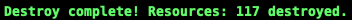

# Using KEDA to Scale AWS SQS with Amazon Elastic Kubernetes Service (EKS) - Part 3: Demo, Autoscaling in Action, and Cleanup


[](https://developer.hashicorp.com/terraform)
[](https://keda.sh/)
[](https://aws.amazon.com/eks/)
[](https://fluxcd.io/)

## Welcome to the Final Part!

In [Part 1 - LinkedIn](lhttps://www.linkedin.com/pulse/using-keda-scale-aws-sqs-amazon-elastic-kubernetes-service-rasmuson-sebec/) / [Part 1 - Medium](https://medium.com/@junglekid_40016/using-keda-to-scale-aws-sqs-with-amazon-elastic-kubernetes-service-eks-part-1-introduction-3b58f7920f32), we explored what KEDA is and its benefits for event-driven autoscaling. In [Part 2 - LinkedIn](https://www.linkedin.com/pulse/using-keda-scale-aws-sqs-amazon-elastic-kubernetes-service-rasmuson-usnkc/?trackingId=i%2FRXZdf%2BReKq5uJXkzN2rA%3D%3D) / [Part 2 - Medium](https://medium.com/@junglekid_40016/using-keda-to-scale-aws-sqs-with-amazon-elastic-kubernetes-service-eks-part-2-architecture-and-6ea6f7d4e2fe), we built the complete infrastructure with Terraform and Flux.

Now it's time to see KEDA in action and learn how to clean up the resources when you're done.

In this article, you'll:

- See KEDA autoscale from 0 to 30+ pods based on SQS queue depth
- Monitor the scaling behavior in real-time
- Learn how to clean up all resources properly

Let's watch the magic happen!

---

## Demo: See KEDA Autoscaling in Action

This section demonstrates KEDA's autoscaling behavior by controlling message flow into the SQS queue and observing how the consumer pods scale in response.

### Optional: Advanced Monitoring with k9s

If you have k9s installed, use it for better visualization:

```bash
# Launch k9s
k9s

# Navigate to:
# - :pods and filter by namespace :sqs-app
# - :hpa to see horizontal pod autoscaler
# - :describe to view KEDA ScaledObject details
```

### Initial State Verification

Before starting, verify your initial state:

```bash
# Check current pod count
kubectl get pods -n sqs-app

# Check HPA status
kubectl get hpa -n sqs-app
```

**Terminal - Expected initial state**:

HPA Before Scale Up


**k9s - Expected initial state**:

k9s Before Scale Up


**Web Browser - Expected initial state**:

Web Browser Before Scale Up


### Step 1: Start / Scale Out SQS Producer Deployment

Scale up the sqs-producer to have the sqs-app website available to trigger the creation of messages:

```bash
# Start the SQS producer
kubectl scale deployment sqs-producer -n sqs-app --replicas=1
```

**Terminal - Expected output**: `deployment.apps/sqs-producer scaled`

**k9s - Expected output**: k9s 1 sqs-producer container running


### Step 2: Access the SQS App Website and Trigger the creation of messages

- Launch your favorite browser and access the sqs-app website
- In the `Enter a number of messages to send to AWS SQS Queue`, and enter a high number such as 30000 in the box.
- Click the `Send Messages (Async)` Button

**Web Browser - Expected output**: Browser - Send Messages


**What to observe**: Producer logs showing messages being sent to the SQS queue.

```bash
# Monitor producer logs to confirm messages are being sent
kubectl logs -n sqs-app -l app=sqs-producer -f
```

**Terminal - Expected output**: Messages are being sent to the SQS queue.


### Step 3: Watch KEDA Trigger Scaling

In a new terminal, monitor the scaling activity:

**NOTE:** `watch` is not installed by default on macOS. If `homebrew` is installed, `watch` can be installed by running `brew install watch`.

```bash
kubectl get hpa -n sqs-app

# Watch pods in real-time
watch kubectl get pods -n sqs-app

# In another terminal, watch HPA
watch kubectl get hpa -n sqs-app
```

**Terminal - Expected output**: HPA Scaling Up 1 Pod


**k9s - Expected output**: k9s Scaling Up 1 Pod


**Web Browser - Expected output**: Web Browser Scaling Up 1 Pod


**What happens**:

1. Messages accumulate in the SQS queue
2. KEDA polls the queue every 30 seconds
3. When the queue depth exceeds the threshold (10 messages/pod), KEDA triggers scaling
4. Consumer pods are created (1-2 pods initially)
5. More pods are added as the queue depth increases
6. Pods start processing and removing messages from the queue

### Step 4: Observe Scaling Up and Down

```bash
# Check current replica count
kubectl get hpa -n sqs-app -w

# View KEDA scaler metrics
kubectl get scaledobjects -n sqs-app aws-sqs-queue-scaledobject -w
```

**Terminal - Expected output**: HPA Scaling Up and Down


**k9s - Expected output**: k9s Scaling Up to 8 Pods


**Web Browser - Expected output**: Web Browser Scaling Up to 8 Pods


**What happens**:

1. No new messages are added to the queue
2. Consumer pods continue processing remaining messages
3. Queue depth decreases as messages are processed
4. KEDA gradually scales down the number of pods
5. After the cooldown period and with an empty queue, the pods scale to zero

### Step 5: Verify Scale-to-Zero

```bash
# Confirm no consumer pods running
kubectl get pods -n sqs-app

# Check HPA shows 0 replicas
kubectl get hpa -n sqs-app
```

**Terminal - Expected output**: HPA Scaled Down


**k9s - Expected output**: k9s Scaling Down


**Web Browser - Expected output**: Web Browser Scaling Down


---

## Clean Up

**Important**: Follow these steps to avoid orphaned resources and potential costs.

### Step 1: Suspend Flux Reconciliation

Prevent Flux from recreating resources during cleanup:

```bash
# Suspend all Flux sources and Kustomizations
flux suspend source git flux-system
flux suspend source git sqs-app
flux suspend kustomization infra-configs
flux suspend kustomization infra-controllers
flux suspend kustomization apps
```

### Step 2: Remove Applications

```bash
# Delete application Helm releases
flux delete helmrelease sqs-app --silent

# Delete Keda HPA Autoscaling
kubectl delete -n sqs-app horizontalpodautoscalers.autoscaling keda-hpa-aws-sqs-queue-scaledobject

# Wait for applications to terminate (1-5 minutes)
echo "Waiting for application removal..."
sleep 120

# Delete application sources
flux delete source git sqs-app --silent
flux delete kustomization apps --silent

# Verify applications removed
kubectl get -n sqs-app all
kubectl get -n sqs-app ingress
```

**Expected result**: No resources in `sqs-app` namespace

### Step 3: Remove Kubernetes Addons

```bash
# Delete any KEDA-managed resources first
kubectl delete scaledobjects --all -A
kubectl delete scaledjobs --all -A

# Delete addon Helm releases
flux delete helmrelease aws-load-balancer-controller --silent
flux delete helmrelease external-dns --silent
flux delete helmrelease karpenter --silent
flux delete helmrelease keda --silent
flux delete helmrelease metrics-server --silent

# Cleanup Keda CRDs
kubectl patch crd ec2nodeclasses.karpenter.k8s.aws -p '{"metadata":{"finalizers":[]}}' --type=merge

# Wait for addons to terminate (2-5 minutes)
echo "Waiting for addon removal..."
sleep 120

# Delete addon sources
flux delete kustomization infra-configs --silent
flux delete source helm eks-charts --silent
flux delete source helm external-dns --silent
flux delete source helm karpenter --silent
flux delete source helm keda --silent
flux delete source helm metrics-server --silent
flux delete kustomization infra-controllers --silent
```

**Verify addon removal**:

```bash
kubectl get -n kube-system all -l app.kubernetes.io/name=external-dns
kubectl get -n kube-system all -l app.kubernetes.io/name=aws-load-balancer-controller
kubectl get -n kube-system all -l app.kubernetes.io/name=aws-cluster-autoscaler
kubectl get -n kube-system all -l app.kubernetes.io/name=metrics-server
kubectl get -n karpenter all
kubectl get -n keda all
kubectl get ingressclasses -l app.kubernetes.io/name=aws-load-balancer-controller
```

**Expected result**: No addon pods running

### Step 4: Manual Resource Cleanup (If Needed)

If any resources remain after addon removal:

```bash
# List remaining Ingresses and delete manually
kubectl get ingress -A
kubectl delete ingress <ingress-name> -n <namespace>

# List remaining Services with LoadBalancer type
kubectl get svc -A | grep LoadBalancer
kubectl delete svc <service-name> -n <namespace>

# Check for remaining KEDA resources
kubectl get scaledobjects -A
kubectl get scaledjobs -A
kubectl delete scaledobject <name> -n <namespace>
```

### Step 5: Uninstall Flux

```bash
# Uninstall Flux from the cluster
flux uninstall --silent

# Verify Flux removed
kubectl get -n flux-system all
```

**Expected result**: `No resources found in flux-system namespace.`

### Step 6: Destroy Terraform Infrastructure

```bash
# Navigate to Terraform directory
cd terraform

# Destroy all AWS resources
terraform destroy

# Confirm destruction when prompted
# Type 'yes' to proceed
```

**Destruction timeline**: 15-20 minutes



**Resources destroyed**:

- EKS cluster and node groups
- VPC, subnets, NAT gateways
- ECR repositories
- SQS queue
- IAM roles and policies
- KMS keys
- Route 53 records
- ACM certificates

## Conclusion

This guide demonstrates how to implement a production-ready, event-driven autoscaling solution with KEDA on Amazon EKS. You learned how to:

- Deploy a complete EKS infrastructure using Terraform
- Implement GitOps workflows with Flux for continuous deployment
- Configure KEDA to scale applications based on AWS SQS queue depth
- Achieve cost optimization through scale-to-zero capabilities
- Manage Kubernetes addons and applications declaratively

### Key Takeaways

**Event-Driven Autoscaling**: KEDA extends Kubernetes autoscaling beyond CPU and memory metrics, enabling applications to scale based on real business events like message queue depth, database queries, or custom metrics.

**Scale-to-Zero Economics**: By scaling to zero during idle periods, you pay only for compute resources when actively processing events, significantly reducing costs for sporadic or batch workloads.

**GitOps Best Practices**: Flux provides automated, declarative infrastructure management, ensuring your cluster state always matches your Git repository and enabling easy rollbacks and auditing.

**AWS Integration**: KEDA's native support for AWS services, combined with EKS's managed Kubernetes experience, creates a powerful platform for cloud-native applications.

### Next Steps

**Production Hardening**:

- Implement comprehensive monitoring with Prometheus and Grafana
- Set up alerting for scaling events and failures
- Configure pod disruption budgets for high availability
- Implement service mesh (Istio/Linkerd) for advanced traffic management

**Scaling Optimizations**:

- Fine-tune KEDA trigger thresholds based on your workload
- Adjust cooldown periods to prevent scaling thrashing
- Configure multiple KEDA scalers for complex event sources
- Implement custom metrics for business-specific scaling triggers

**Security Enhancements**:

- Enable Pod Security Standards at the cluster level
- Implement network policies for zero-trust networking
- Set up AWS GuardDuty for threat detection
- Configure AWS Config for compliance monitoring

**Advanced Features**:

- Explore KEDA ScaledJobs for batch processing
- Implement multi-queue processing with different scalers
- Add circuit breakers for downstream service protection
- Configure priority classes for critical workloads

### Additional Resources

- **KEDA Documentation**: [https://keda.sh/docs/](https://keda.sh/docs/)
- **Flux Documentation**: [https://fluxcd.io/docs/](https://fluxcd.io/docs/)
- **AWS EKS Best Practices**: [https://aws.github.io/aws-eks-best-practices/](https://aws.github.io/aws-eks-best-practices/)
- **Karpenter Documentation**: [https://karpenter.sh/docs/](https://karpenter.sh/docs/)

Thank you for following this guide. For questions, issues, or contributions, please visit the [GitHub repository](https://github.com/junglekid/aws-eks-keda-sqs-lab).

---

**This concludes our three-part series on KEDA with AWS EKS. Happy scaling!**

**Found this series helpful? Like, comment, and share!**

**Have questions about KEDA or the demo? Drop them in the comments below.**

---

## 🗟️ License

MIT License © 2025 [Dallin Rasmuson](https://www.linkedin.com/in/dallinrasmuson)

---

#Kubernetes #AWS #EKS #KEDA #CloudNative #DevOps #Autoscaling #CloudComputing #Infrastructure #GitOps #Terraform #SRE #CloudArchitecture #CostOptimization #Production
